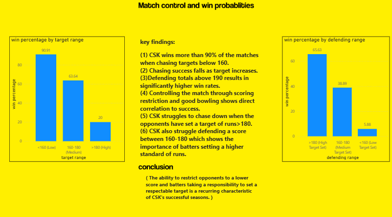

# Understanding the Success and Decline of CSK (2018–2026)
> A data analytics project investigating what made Chennai Super Kings win, what broke, and what the data says about a rebuild.

---

## Overview

Chennai Super Kings are one of the most successful franchises in IPL history — yet between 2024 and 2026, something broke. This project uses ball-by-ball IPL data to investigate the factors behind CSK's championship seasons, identify what changed during the decline, and generate evidence-based recommendations for the future.

This is not a dashboard project. The goal is to use data to tell a story.

**131 matches | 9 seasons | 2018–2026**

---

## Tech Stack

| Tool | Purpose |
|------|---------|
| Python | ETL, JSON parsing, data cleaning |
| MySQL | Data modelling, star schema, SQL analytics |
| Power BI | Dashboard design and visual storytelling |
| GitHub | Documentation and portfolio |

---

## Key Questions

- What separates CSK's winning seasons from their losing ones?
- Does batting performance explain success — or is it bowling?
- Has CSK lost its traditional spin advantage?
- How important is Chepauk to CSK's identity?
- What explains the collapse after 2023?

---

## Key Findings

**Bowling drives success more than batting.**
Strong seasons (2018, 2021, 2023) all featured 90+ total wickets. The 2025 season marks CSK's biggest bowling collapse since 2018.

**Powerplay wickets are the strongest single indicator of a title-contending season.**
Every CSK season that reached the final had elite early wicket-taking ability.

**Batting metrics alone don't predict outcomes.**
2025 had a higher opening average than 2019 — yet was a significantly worse season. Batting numbers create a misleading picture without bowling context.

**Home advantage at Chepauk collapsed in 2025.**
CSK won only 1 of 4 home games (16.67% win rate), compared to a historical home win rate above 70% during title seasons.

**Defending totals correlates more strongly with success than chasing.**
CSK's identity is built around setting and defending competitive scores — not chasing.

**Spin dominance has weakened, but not disappeared.**
Spin economy has risen from 6.6 to 8.4 in recent seasons. CSK still bowl spin better than pace, but the margin that once defined Chepauk has narrowed significantly.

---

## Dashboard

### Executive Summary

### Batting Analysis

### Bowling Analysis

### Spin vs Pace Analysis

### Venue Analysis — Importance of Chepauk

### Match Control & Win Probabilities

### Final Conclusions & Recommendations

---

## Data Source

Ball-by-ball IPL data from [Cricsheet](https://cricsheet.org) in JSON format, covering all CSK matches from 2018 to 2026.

---

## Project Limitations

- Individual performances, injuries, and tactical decisions are not captured in ball-by-ball data
- 2020, 2021, and 2022 seasons were not played at Chepauk, limiting venue analysis for those years
- External factors (auction strategy, pitch conditions) were not analysed
- Analysis is scoped to CSK only

---

## Author

**Tharun Anand**  
First-year Engineering Student | Aspiring Data / Analytics Engineer  
[GitHub](https://github.com/your-username) · [LinkedIn](https://linkedin.com/in/your-profile)
