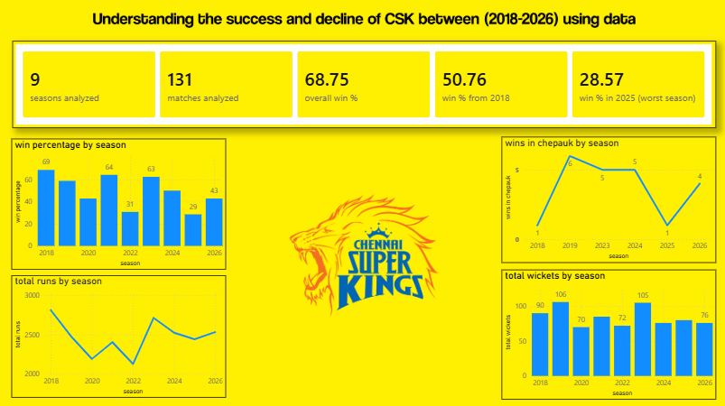
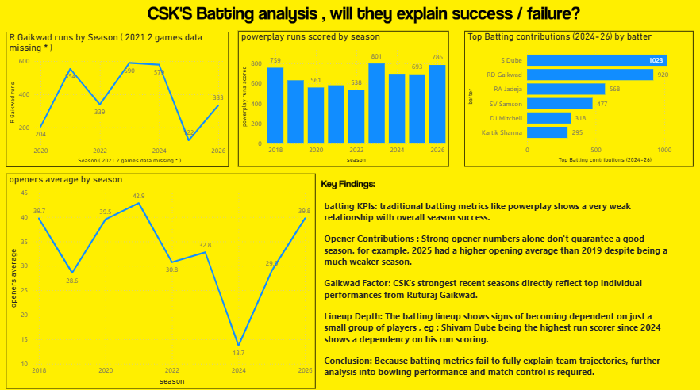
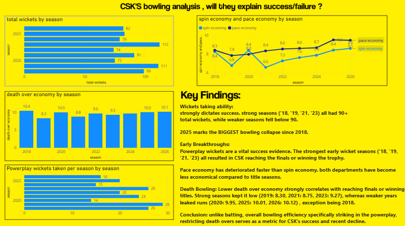
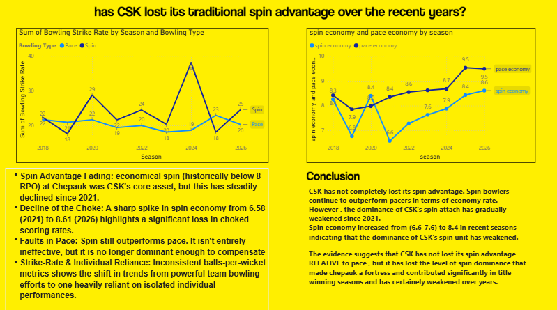
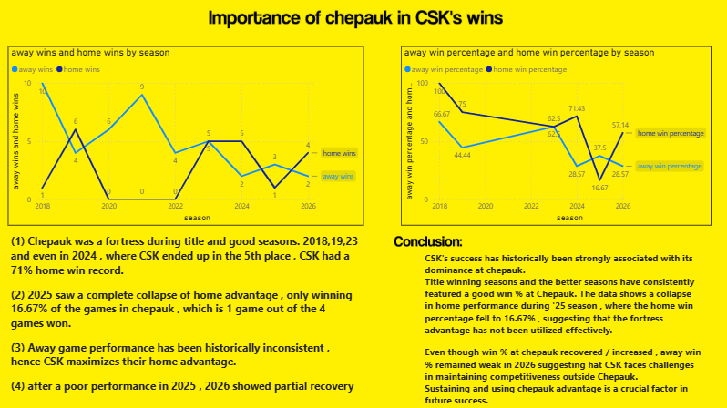
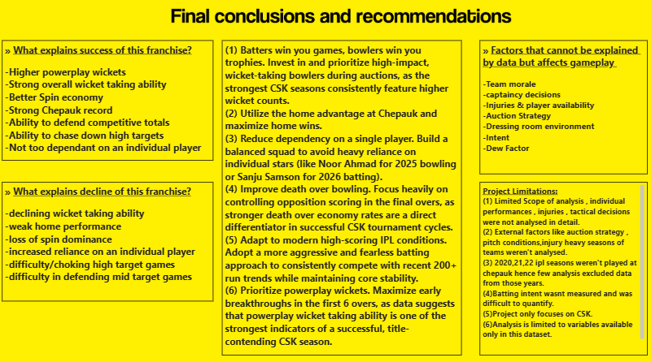

Understanding the success and decline of CSK between (2018-2026) using data.

(1)Overview:

A data analytics project investigating the factors behind Chennai Super Kings' success and decline between 2018 and 2026 using IPL , ball by ball data.

The project combines Python, MySQL and Power BI to identify the batting, bowling and venue related factors most associated with successful CSK seasons.

(2)Tech stack used in this project:

Python (ETL & Data Cleaning)
MySQL (Data Modelling & Analysis)
Power BI (Dashboard & Visualization)
GitHub

(3)Key questions:

->What explains successful CSK seasons?
->Does batting explain success?
->Does bowling explain success?
->Has CSK lost its spin advantage?
->Importance of Chepauk in CSK's success
-> What explains the decline after 2023?

(4)Key Findings:

->Bowling explained season success more clearly than batting.
->Powerplay wickets were one of the strongest indicators of success.
->Successful teams consistently possessed elite bowling strengths.
->Home advantage collapsed significantly in 2025.
->Defending totals correlated more strongly with success than chasing totals.
->CSK's traditional spin dominance appears to have weakened in recent seasons.

(5)Dashboard:

The Power BI dashboard includes:

->Executive Summary / Introduction to the analysis

->Batting Analysis

->Bowling Analysis

->Spin vs Pace Analysis

->Venue Analysis

->Match Control Analysis

->Final Conclusions & Recommendations

Author:

Tharun Anand
